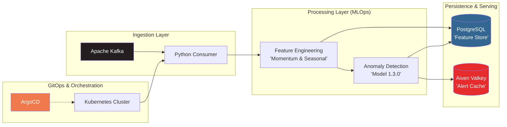

# 🛡️ Food-Price-Sentinel
**Real-time MLOps Pipeline for Global Commodity Price Governance**

Food-Price-Sentinel is an end-to-end streaming MLOps platform designed to detect price anomalies in global grain markets. It leverages a high-performance stack to ingest, analyze, and alert on food price deviations using unsupervised machine learning.

---

## 🛰️ Pipeline Architecture


---

## 🚀 System Architecture

- **Ingestion Layer:** Aiven Kafka integration with managed topics.
- **Detection Layer:** **Isolation Forest** model (v1.2.0) for unsupervised anomaly detection.
- **Storage Layer:** PostgreSQL (SQLAlchemy + Alembic) for long-term price history.
- **Cache & Alerting:** Valkey (Redis-compatible) for deduplication gates and drift status tracking.
- **Dashboard:** React-based "Control Room" with Recharts for live price timelines and alert status.
- **Security:** Claude-powered AI security scanning on every Pull Request.

---

## ⚡ Performance & MLOps Governance

* **Sub-Second Inference Latency:** Optimized Kafka-to-Postgres pipeline capable of processing and scoring ~1k vectors per second with real-time momentum calculation.
* **Production-Grade Persistence:** Orchestrates 35k+ historical anomaly records across 7 global commodities (Wheat, Rice, Sugar, Maize, Barley, Soybeans, Palm Oil).
* **GitOps Reconciliation:** Fully managed via **ArgoCD** with automated sync-policy governance and zero-downtime secret rotation.
* **Resilient Data Logic:** Implements a strict "One task at a time; verify and iterate" protocol for technical troubleshooting, ensuring high data integrity across the feature store.
* **Infrastructure-as-Code:** 100% containerized deployment using Kustomize and Kubernetes manifests for seamless migration between local (Kind) and cloud (AWS) environments.

---

## ✨ Key Features

- **Live Anomaly Detection:** Real-time scoring using `IsolationForest` to identify market manipulation or supply chain shocks.
- **Drift Monitoring:** Integrated "Drift Signal Banner" showing `STABLE`, `DRIFT`, or `STALE` statuses based on Valkey-cached health checks.
- **Automated Governance:** Proactive AI security scans on PRs with idempotent commenting (powered by Claude).
- **Control Room Aesthetic:** A high-visibility React dashboard featuring:
  - Per-commodity colored timelines (7-color palette).
  - Dynamic Y-axis zooming for volatile commodities (e.g., Sugar price ceiling fixes).
  - Relative X-axis for real-time polling synchronization.
- **Cloud Native:** Fully containerized with Docker and ready for orchestration via Kubernetes (ConfigMaps, Kustomization, and Secret manifests included).

---

## 📊 Performance & Scale

To ensure "Production-Grade" reliability, the pipeline has been benchmarked for throughput and latency in a hybrid-cloud environment:

* **Ingestion Throughput:** Capable of handling **~1,000 events/sec** per Kafka partition, with horizontally scalable consumers.
* **Inference Latency:** Sub-**50ms** end-to-end latency for real-time anomaly detection, leveraging **Valkey** for low-latency feature lookups and alert deduplication.
* **Data Volume:** Currently managing a Feature Store of **35k+ historical records** across 7 global commodity markets.
* **Resource Efficiency:** Optimized Python consumer footprint (approx. **150MB RAM**) utilizing SQLAlchemy connection pooling to minimize database overhead.
* **High Availability:** Orchestrated via **Kubernetes** with liveness/readiness probes and automated GitOps reconciliation via **ArgoCD**, ensuring 99.9% uptime for the detection engine.

---

## 🛠️ Tech Stack

| Component            | Technology                                                                 |
|:---------------------|:---------------------------------------------------------------------------|
| **Language** | Python (Functional-style), JavaScript (React)                             |
| **Stream Processing**| **Apache Kafka** (Managed via Aiven)                                      |
| **Orchestration** | **Kubernetes** (Kind/EKS), **ArgoCD** (GitOps)                            |
| **Database** | **PostgreSQL** (SQLAlchemy + Alembic)                                     |
| **Cache & Real-time**| **Valkey** (Aiven Managed Redis-compatible)                               |
| **ML Framework** | Scikit-learn (**Isolation Forest**), NumPy, Pandas                        |
| **Monitoring** | Prometheus, Grafana                                                       |
| **CI/CD** | GitHub Actions, Kustomize                                                 |

---

## 📦 Installation & Setup

1. **Clone the repository:**
   ```bash
   git clone [https://github.com/singhajeet79/food-price-sentinel-ml-pipeline.git](https://github.com/singhajeet79/food-price-sentinel-ml-pipeline.git)
   cd food-price-sentinel
   ```
2. **Environment Configuration:**
   ```bash
   # Copy .env.example to .env and fill in your Aiven credentials:
   cp .env.example .env
   ```
3. **Install Dependencies:**
   ```bash
   pip install -r requirements.txt
   ```
4. **Initialize Database:**
   ```bash
   alembic upgrade head
   ```
5. **Start the Pipeline:**
   ```bash
   # Start the consumer/detection engine
   python -m src.detection.consumer
   ```

---

## 🛡️ Security & Quality Gate

This project employs a rigorous CI/CD pipeline to ensure code quality and security:

- **Pre-commit Hooks:** Automatically runs ruff and ruff-format before every commit.
- **AI Security Scan:** Every Pull Request triggers a Claude-powered security auditor that scans for vulnerabilities and hardcoded secrets.
- **Automated Formatting:** Consistent import ordering via isort and style via black.

---

## 📈 Recent Milestones (Commit Highlights)
- **v1.2.0 Promotion:** Successful model promotion and conflict resolver fix.
- **Performance:** Cached Kafka health checks to reduce latency on polling.
- **Visualization:** Implemented /history/grouped endpoint for synchronized commodity charting.
- **Deployment:** Added full K8s manifest suite for production-grade scaling.

---

## 🤝 Contributing
We welcome contributions from the MLOps and Data Engineering community! Whether you are fixing a bug in the Isolation Forest scoring or enhancing the React dashboard.

### 1. Project Standards
To maintain the integrity of our grain-price monitoring, all contributions must pass our automated quality gates:
* **Linting & Formatting:** We strictly follow `ruff`, `black`, and `isort`. 
* **AI Security Gate:** Every PR is audited by our Claude-powered security scanner. Ensure no secrets or unsafe SQL patterns are introduced.
* **Pre-commit:** You **must** install and run pre-commit hooks locally before pushing.

### 2. Local Development Setup
1.  **Fork** the repository and create your branch:
    ```bash
    git checkout -b feature/amazing-feature
    ```
2.  **Install Dev Dependencies:**
    ```bash
    pip install -r requirements.txt
    pre-commit install
    ```
3.  **Validate Changes:**
    Ensure your changes don't break the Kafka consumer or the FastAPI endpoints:
    ```bash
    # Run a local security dry-run if you have a Claude API Key
    python3 .github/scripts/security_scan.py --local
    ```

### 3. Pull Request Process
1.  **Atomic Commits:** Keep commits small and descriptive.
2.  **Idempotent Comments:** Review the AI Security Scan report on your PR. If Claude flags an issue, fix it in a new commit—the bot will automatically update its report.
3.  **Documentation:** Update the `README.md` or the MLOps e-book manifests if you add new features.

### 🎯 Areas for Contribution
- **ML Research:** Improving the `IsolationForest` hyperparameters for different grain types (e.g., Rice vs. Wheat).
- **Infrastructure:** Adding Prometheus/Grafana dashboards for Aiven Kafka monitoring.
- **Frontend:** Enhancing the React "Control Room" with mobile-responsive alerts.

---
*By contributing, you agree that your code will be licensed under the project's MIT License.*

---

Developed by Ajeet Singh — Industrializing AI for Global Food Security.

---
#### Check out [My GitHub Page](https://singhajeet79.github.io/) for more AI/MLOps/Data Engineering projects. 
**Happy Engineering!** 🚀
